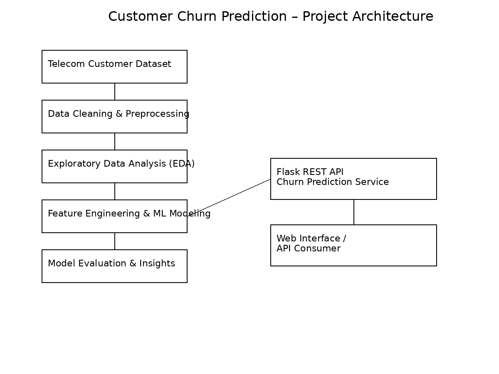

# Customer-Churn-Prediction-Machine-Learning-Project
📊 Customer Churn Prediction – Analytics & Machine Learning Project
📌 Project Overview

Customer churn is a critical business challenge in the telecom industry. This project focuses on analyzing customer data to identify key factors influencing churn and building a machine learning–based solution to support data-driven decision making.

The objective is to demonstrate an end-to-end analytics workflow—from data exploration and insight generation to model development and deployment—while maintaining a strong focus on business relevance and interpretability.

🎯 Objectives

Analyze customer behavior to understand why customers churn

Perform exploratory data analysis (EDA) to uncover trends and patterns

Build classification models to predict churn

Translate analytical results into clear, actionable insights

Demonstrate how analytics and ML can support operational intelligence

Deploy the solution for interactive prediction

🧱 Project Architecture

🧠 Key Concepts Covered

Data Cleaning & Preprocessing

Exploratory Data Analysis (EDA)

Feature Engineering

Classification Models

Model Evaluation

Business Interpretation of Results

Model Deployment (Flask API)

🛠️ Tech Stack

Programming Language: Python

Libraries: Pandas, NumPy, Matplotlib, Seaborn, Scikit-learn

Model Deployment: Flask (REST API)

Tools: Jupyter Notebook, VS Code

📂 Project Workflow

Data Understanding

Reviewed dataset structure and customer attributes

Identified missing values and inconsistencies

Exploratory Data Analysis

Analyzed churn distribution and customer behavior patterns

Identified key variables impacting churn

Data Preparation

Cleaned and transformed data

Encoded categorical variables and scaled features

Model Development

Built and evaluated classification models

Compared models using standard evaluation metrics

Insights & Interpretation

Interpreted results in a business context

Highlighted drivers of customer churn

Deployment

Deployed the trained model as a Flask-based REST API

Enabled interactive churn prediction through a web interface

📈 Results & Insights

Identified key customer attributes influencing churn behavior

Demonstrated how analytics can support retention-focused decisions

Showcased a complete analytics-to-deployment pipeline

⚠️ Note: The project focuses on interpretability and practical application rather than aggressive optimization, aligning with real-world analytics use cases.

🚀 How to Run the Project

Clone the repository

git clone https://github.com/your-username/customer-churn-prediction.git

Install required libraries

pip install -r requirements.txt

Run the Flask application

python app.py

Access the API or web interface locally

📌 Key Takeaways

Demonstrates end-to-end analytics and ML workflow

Emphasizes business understanding over model complexity

Highlights clear communication of insights

Suitable for entry-level analytics and ML-aware roles

👤 Author

Abhishek Hiremath
Aspiring Analytics & Data Professional
📍 India
